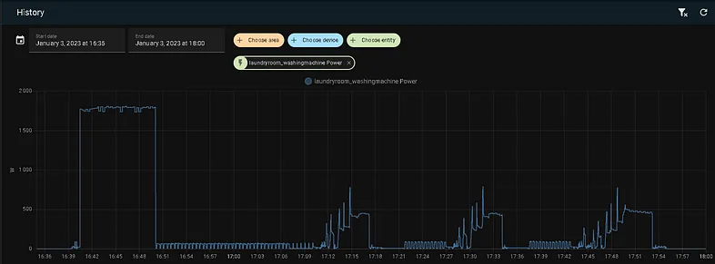
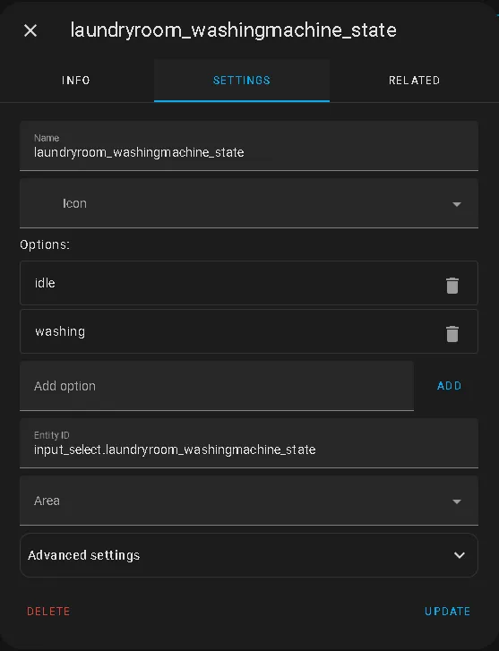
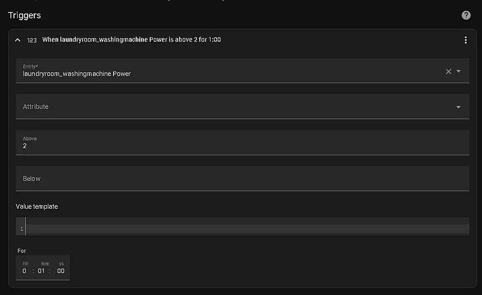
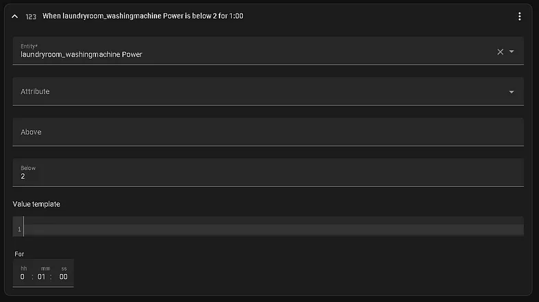
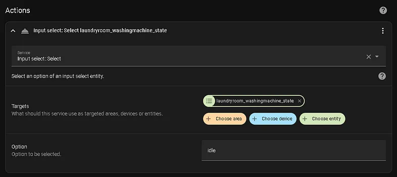
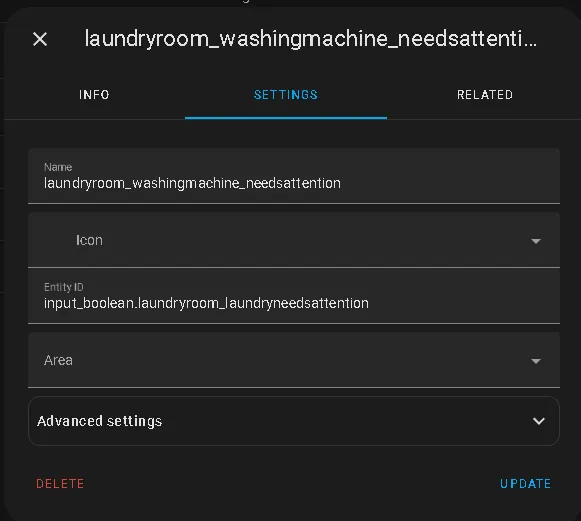
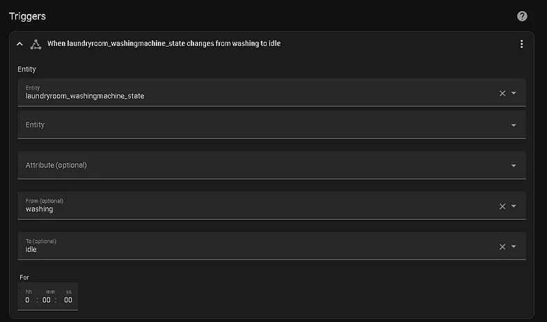
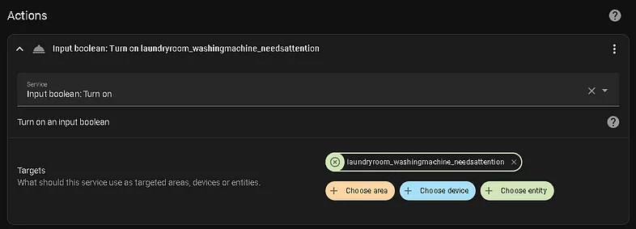
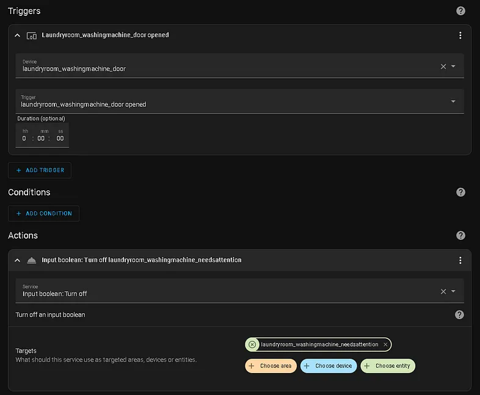
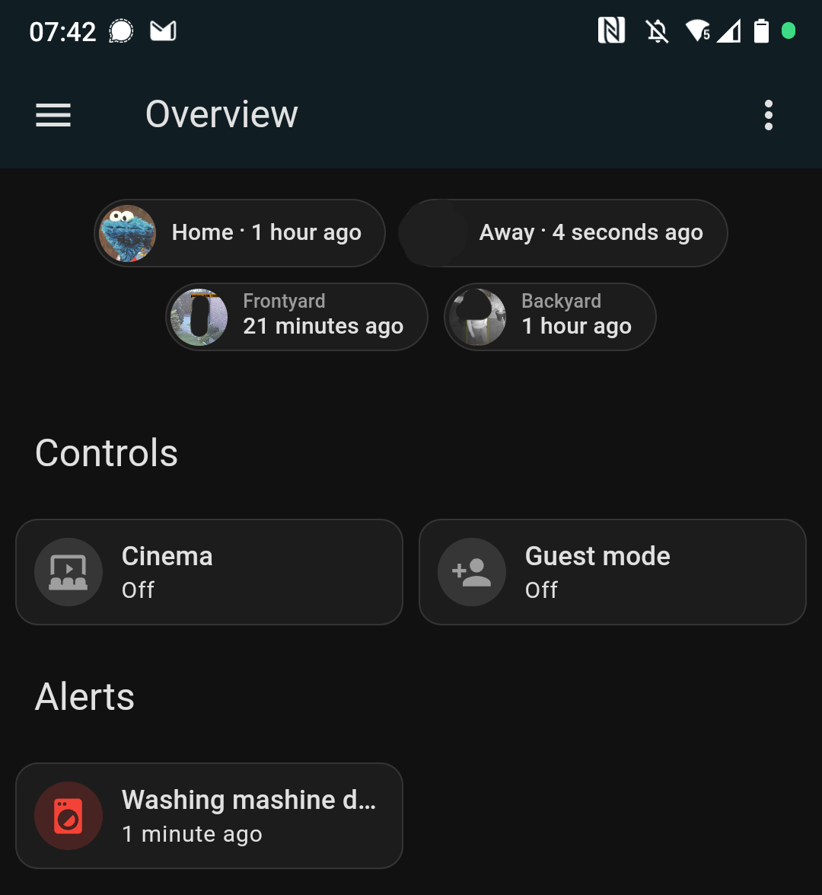

We have kids. Having kids comes with having lots of laundry. Our washing machine runs nearly every day. God forbid if we’d forget to hang out a single load of laundry. The pile would stack up indefinitely…

> We can’t handle that much pressure! That’s why Home Assistant has to help us.

## The Problem
A common situation we were facing is the following:

* We started the washing machine with a big load of kids-laundry in the evening.
* We went right to the couch and watched some Netflix.
* We went to sleep.
* We woke up the next morning with the instant knowledge that we forgot the laundry in the washing machine.
* The laundry stinks due to lying around wet in the drum all night
* We have to wash that load again
* The next kids-laundry-load stacks up the pile.

That happened way too often. That’s why I decided to make my laundry smart!

## Step 1: Gathering data
Our [washing machine](https://amzn.to/3ZJhciU) is really dumb. But there is a common approach in the community to integrate these kind of machines into Home Assistant:

> You can detect the state of the washing machine by looking at its current power consumption.

All I need to retrieve the current power consumption of the washing machine is a [smart plug](https://amzn.to/4elBvqV) with integrated power monitoring. Just make sure to check the data sheet — you’ll want one that allows at least `2.5kW` before shutting off!

After integrating that plug into Home Assistant, do some washing runs! Try your favorite programs — for us it’s `40°C` and `60°C`. Afterwards you can check the power graphs inside the history right from Home Assistant!

## Step 2: Defining the states
This step was easy. Our washing machine can only have two states: Either it’s `washing` or it’s `idle`. I capsuled these two states in an *input_select* helper.

## Step 3: A logic for setting the states
Look at the graph of my washing machine again:

* Right after I started the run the power goes above `2W`.
* This is followed by a very high power consumption around `1800W`. This is where the washing machine heats up the water.
* Later there are several peaks when the laundry gets spun.
* At the end the power consumption drops below `2W` again.

Knowing that after analyzing several graphs I created an automation that sets my helper entity’s state to `washing` when the power consumption is bigger than `2W` for at least `60s`.

 

I need a second automation to reset my helper entity’s state back to `idle` when the power consumption is below `2W` for at least `60s`.

 

## Step 4: Defining when the laundry needs attention
Now we know whether the washing machine is `idle` or `washing`. But we don’t know whether the laundry needs any *attention*. Idle can mean two things:

* The washing machine can be `idle` and empty.
* The washing machine can be `idle` but filled with wet laundry.

I therefore created another helper entity. It’s a simple *input_boolean* which will tell me whether I have to do laundry stuff or can stay on the couch.

I enable this *input_boolean* with another automation. As soon as the state of my washing machine changes from `washing` to `idle`, I know that it’s done and that my laundry needs attention.

 

## Step 5: Knowing when the laundry was taken care of
The alert reader might already ask how the attention *input_boolean* will be reset. As soon as my wife or me opens the washing machine I can be `95%` sure that the laundry gets hung out right away. So I use exactly that as a trigger!

I bought and attached a [cheap contact sensor](https://amzn.to/3TNr878) to my washing machine’s door. That way I can reset the *input_boolean* in an automation right when the door gets opened:

## Benefits
I now know whether my laundry needs attention or not. This enables me to do some real cool automations:

* I can make a TTS announcement on my [Sonos speakers](https://amzn.to/3XLmWG7) which scrambles us to finally take care of the laundry as soon as the washing machine is done.
* I can remind as just before going to bed that there are still wet kid-socks in the washing machine.
* I can color the laundry icon on my dashboard red when there is some laundry work to do.

## Conclusion
Making a dumb washing machine smart is really **easy** and **inexpensive**. Nevertheless it is really **helpful** and not just kid’s stuff. My wife loves that there are no more stinky laundry surprises in the morning.

I took the same approach for making our [dryer](https://amzn.to/47ON0Vl) smart.

Damn… The washing machine just send a notification to my phone. :-/

Thanks for reading!