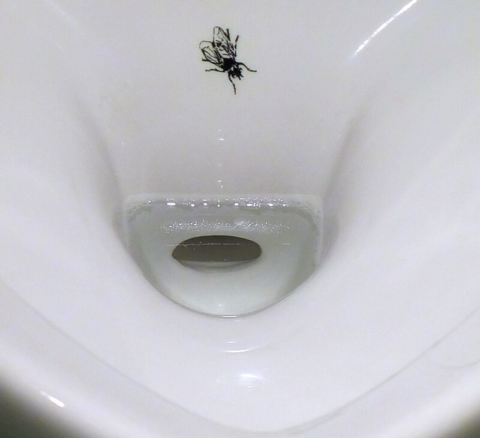
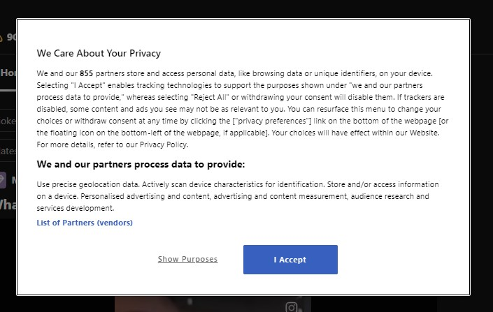

Recently, I heard the term *cookie nudging* for the first time in a podcast and, to be honest, I had to research what that means exactly.

## Nudging
*Nudging* means influencing a person in a desired direction. And not through guidelines or bans, but through psychological methods. The classic example of such a *nudge* is the fly in a urinal.

It seems that the image of the fly alone leads to significantly less splashing outside the urinal. There is no *don't-urinate-on-the-floor* sign. There is no drill instructor explaining how to hit the bowl's center. 

> The image alone is enough to make men aim for the correct spot.

## Cookie Nudging
Almost every website we visit directly shows us a cookie banner. We are given the choice of whether to generally accept or reject all cookies, or to make fine-grained adjustments to the cookie settings. 

The owners of these sites naturally wish for as many cookies as possible to be accepted, as they need them for certain functionalities, targeted advertising, or user analysis.

Therefore they often use a *nudge*, as well: The *accept* button usually has bold text and is colored green, while the reject button is unflashy or not displayed at all. 

Subconsciously, we immediately press the green button because we want to quickly get to the actual website. A small but subtle psychological trick that pushes us in the desired direction of the website operator. A cookie nudge.

## Social Engineering
Even though this is a trivial use case, it shows how susceptible we are to such small tricks. Cookie nudging is a form of social engineering. We should condition ourselves better not to accept everything out of convenience that stands between us and the content we want to see. Data is becoming increasingly important.

By the way, in the same context, I learned about the browser extension *I don't care about cookies*. This automatically closes the cookie banner with *reject all* when opening a page. This protects privacy and saves nerves. Highly recommended.