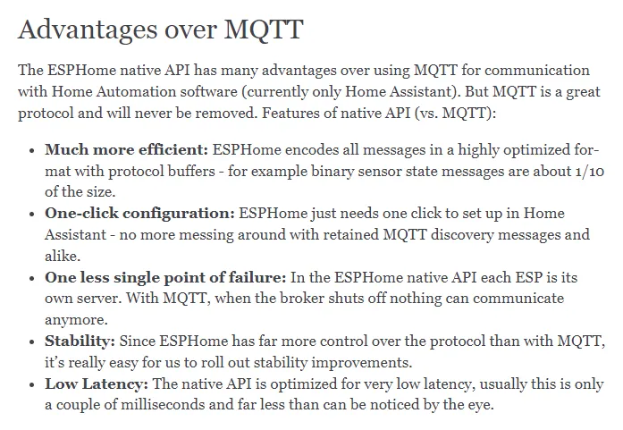
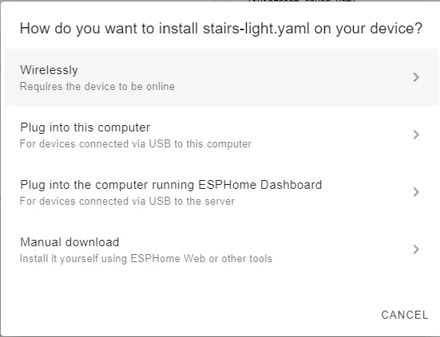
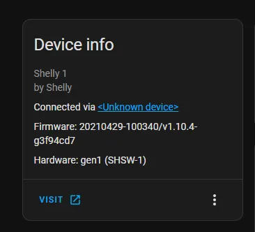
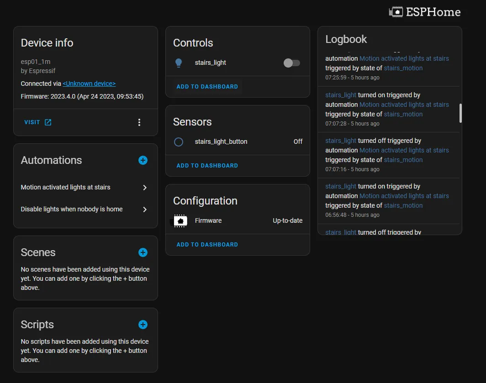

## The Problem
My house is flooded with smart relays from Shelly.

* I use multiple [Shelly 2.5](https://amzn.to/3LJYm2f) to control all the covers in my house
* I use a [Shelly 1PM](https://amzn.to/3LKJiSg) to keep track of the production of my [balcony power plant](https://amzn.to/4cQXyV1)
* I use many [Shelly 1](https://amzn.to/4e69Rhd) to automate my light switches

I have at least 30 smart relays around my house/garden and they work flawlessly!
But then there are one or two relays that give me headaches. Especially the one controlling the lights at my stairs. These lights are motion-controlled and I expect them to go off 3 minutes after all motion cleared. But over the last couple of weeks, this has not been happening.. This is very annoying since I had to get out of bed and switch them off manually.

So I checked the Home Assistant logs regularly to find the root cause. But all I found was the generic error `DeviceConnectionError()`.

Then I stumbled on something interesting in the [ESPHome docs](https://esphome.io/components/api.html):



That’s why I decided to give ESPHome a try and looked for a way to flash ESPHome onto my Shelly. Maybe this might finally fix the connection errors! Let’s get going!

## Creating the ESPHome firmware
Go to ESPHome and add a new device. We do **not** need to connect our Shelly to the computer since we can do everything *OTA* (over-the-air).

Click on edit and insert and tweak the following configuration to fit your needs:

```yaml
# Basic Config
esphome:
  name: stairs_light_shelly
  platform: ESP8266
  board: esp01_1m

wifi:
  ssid: !secret wifi_ssid
  password: !secret wifi_password

logger:
api:
ota:

# Device Specific Config
output:
  - platform: gpio
    pin: GPIO4
    id: relayid

light:
  - platform: binary
    name: "stairs_light"
    output: relayid
    id: lightid

binary_sensor:
  - platform: gpio
    pin:
      number: GPIO5
    name: "stairs_light_button"
    id: switchid
```

Hit save, click the 3 dots and select install. Choose *Manual download* and download the firmware file in *modern format*.



After the file was created and downloaded, we have to zip it since the file would be too big to upload it onto the Shelly 1. I use [7-Zip](https://www.7-zip.org/) for that. Simply right-click the file and compress it to **gzip**!

You should now have a Shelly 1 ESPHome firmware with extension `.bin.gz` on your drive.

## Flashing Tasmota as intermediate firmware
Check which IP is assigned to the Shelly you want to flash. You can see this in your [router](https://amzn.to/3NNV40z) or by clicking *Visit* from inside Home Assistant.



Check the table in [this repository](https://github.com/alexdelprete/mgos-to-tasmota). In case of a Shelly 1 you’d have to enter the following URL into the browser:

```
http://YOURIPADDRESS/ota?url=http://ota.tasmota.com/tasmota/shelly/mg2tasmota-Shelly1.zip
```

This will flash Tasmota onto your Shelly.

After 2 minutes you should see a new WiFi network with a name like `tasmota-XXXXX`. Connect to it and head over to [http://192.168.4.1](http://192.168.4.1)

Here you can enter your WiFi credentials and hit save. Tasmota will now connect to your WiFi.

## Flashing our ESPHome firmware
Go back to the IP address of your Shelly. You should see the default page of Tasmota.

Now it’s important to click on Console and enter

```
SetOption78 1
```

The console should confirm that you enabled the option 78. This enables us to flash firmware files that are not Tasmota builds.

Now head back to the main menu, select *Firmware Upgrade* and upload the firmware file we created previously. Start the upgrade! If everything worked out you should get a success message.

## Integration into Home Assistant
After a short time (or a forced restart of Home Assistant), you will receive a notification that a new ESPHome device has been discovered — automatically!

That was easy.



## Summary
It is possible to flash ESPHome onto many kinds of [Shelly smart relays](https://amzn.to/4dQAKG4) simply over-the-air. For me this fixed the connection issues I had with a specific Shelly 1.

This tutorial might help you if you are trying to solve the same problem!