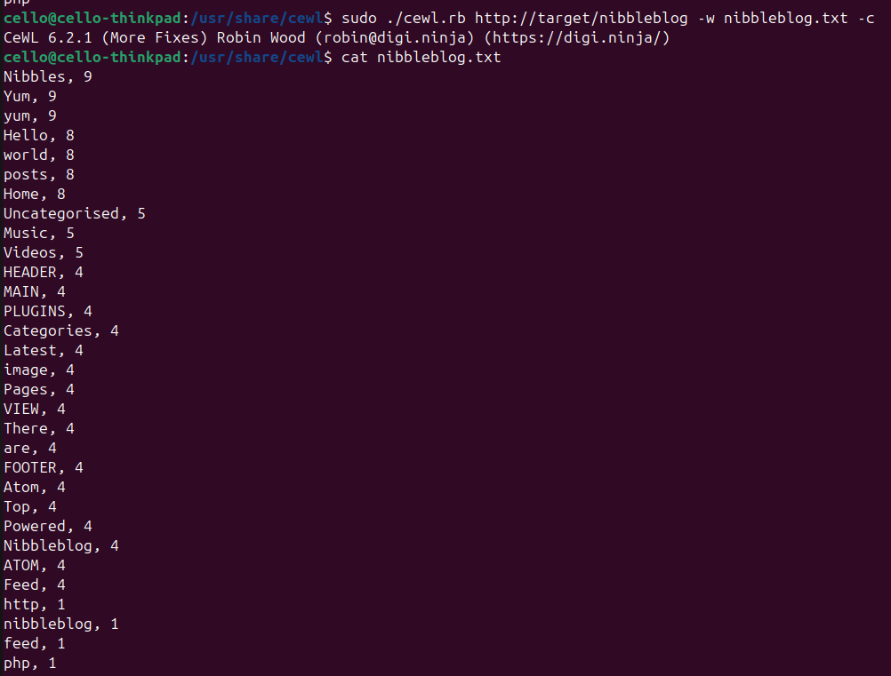

This is my walkthrough for the machine `Nibbles` on [Hack The Box](https://referral.hackthebox.com/mzBNP9n).

### Enumeration
As usual we are only given the IP of our target machine. For convenience let's add that IP into our `/etc/hosts` file. That way we can simply use `target` instead of re-typing the whole IP whenever we need it for a command.

Next is a full scan with [Nmap](https://nmap.org/). I like to add the flag `--open` to only get open ports and not pollute the result with so much noise. The flag `-p-` tells Nmap to scan **all** ports, not just the most common ones.

We see that there is an open `http port 80`. Let's use cURL to see if we get a response from there.

We get a boring **Hello world!**. But further down, we see a hint. It seems like there is a sub-directory called `nibbleblog`. Let's cURL `http://target/nibbleblog` and we get quite a huge response. So we better open that in the browser:

Alright! Looks like some dude named `Nibbles` runs a blog about `Yum yum`, or a dude named `Yum yum` runs a blog about `Nibbles`!? Either way around, that sounds wrong. But unfortunately there is nothing more interesting to find here, I guess. There are no posts yet. There is no `about` page, no `login` page, no `guestbook`. So let's enumerate further and start [gobuster](https://github.com/OJ/gobuster) to see if we can find more hidden sub-directories of that blog. We use a list from [SecLists](https://github.com/danielmiessler/SecLists) for that.

Nice, we have quite some findings! Let's start with the `/README` since that really sounds promising.

This provides us with some URLs that give insights to `nibbleblog` which appears to be a `CMS` for blogs. This also gives us a first inside into the tech stack of the blog: It runs on `PHP`. Let's verify that with [WhatWeb](https://whatweb.net/).

We see `PHP` again, so that seems to be correct. Also we that the blog might be running on `Ubuntu`. 

Let's check the next URL we found. `/content` is very interesting since it contains further sub-directories called `/private` and `/tmp`. Digging deeper we can find file called `config.xml`.

 

There is a lot more `nibbles` and `yum yum` garbage. But there are also some email addresses, especially `admin@nibbles.com`. This could indicate that `admin` is a possible user name for the blog. We are able to verify that in the next file called `users.xml`.

Moving on to `/admin` gives us login page. Knowing that `admin` is a valid user, let's try some obvious passwords like `admin`, `administrator`, `password`. Sadly that does not work.

Let's run [CeWL](https://github.com/digininja/CeWL) to generate a custom wordlist that we might use later to brute-force the password. CeWL crawls the whole page and collects long words and/or words that are mentioned very often.

Wow. `Nibbles` is really mentioned `9` times. And, thank god, the password `nibbles` grants us access to the admin area of the page. From here we are able to publish new blog posts, change the theme, or tweak some settings. Also there are some plugins installed. One let's you upload an image. When we try that, the image appears in the already found directory `content/private/plugins/my_image/`.

 

### Initial Access
Since we are now able to upload a file and also access it afterwards, let's try to upload a `web shell` for PHP. We use a simple test string for that.

  

Since that worked, let's go a step further and upload a `reverse shell` to gain our first foothold on the target. We can find all kinds of `reverse shells` on pages like [GTFOBins](https://gtfobins.github.io/).

  

### Privilege Escalation
Now that we are in, we have to gain ourselves `root` rights. This includes re-starting the enumeration phase of our attack. We just found a file called `personal.zip` right next to the user flag. We should check that out.

That script is quite big. We will defer digging deeper into it and proceed our enumeration first. Let's upload one of the big privilege escalation scripts like [LinEnum](https://github.com/rebootuser/LinEnum) or [LinPEAS](https://github.com/peass-ng/PEASS-ng/tree/master/linPEAS) onto our target and execute it. We do that by serving a `http server` via `python` on our machine and get the file on our target machine via `wget`.

 

After executing the script on our target machine we get a finding. It seems like our user `nibbler` is allowed to run the previously found script `monitor.sh` as `root` without password!

In that case let's visit [GTFOBins](https://gtfobins.github.io/) again, grab a `reverse shell`, append it to the file `monitor.sh`, and execute the script.

 

We are `root`! Now we own the machine. All there is left to do, is getting the `root` flag.

