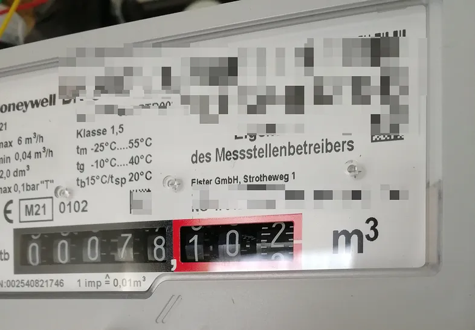
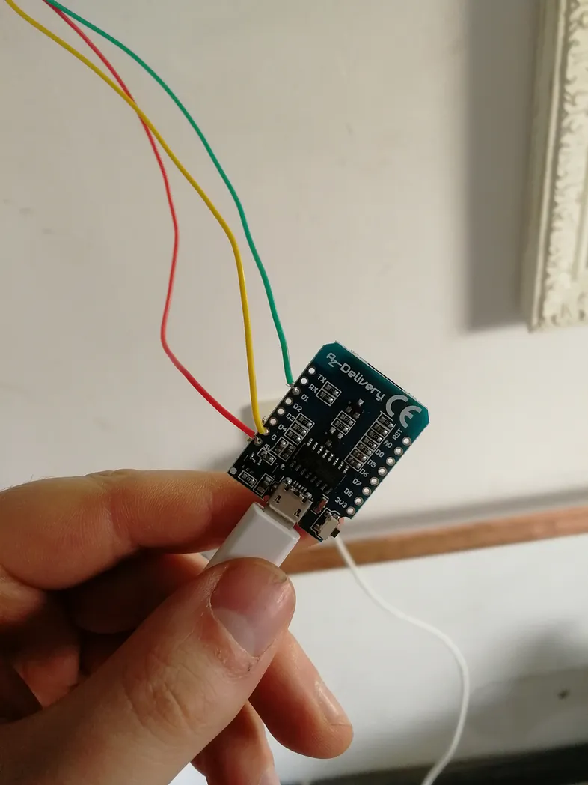
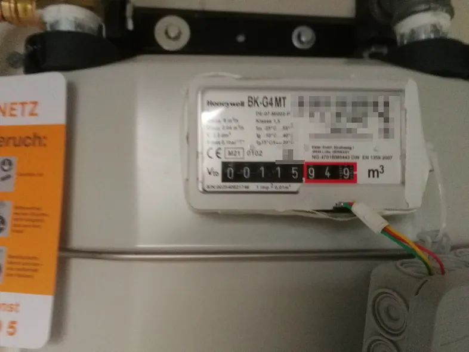
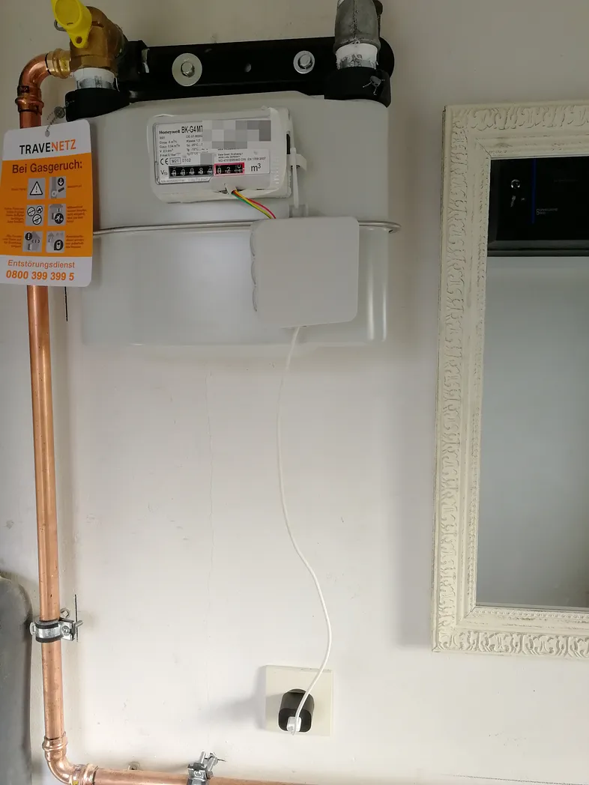
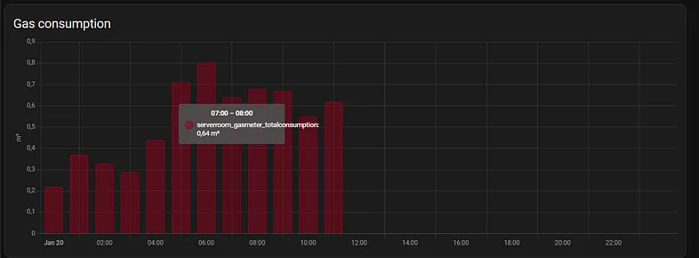
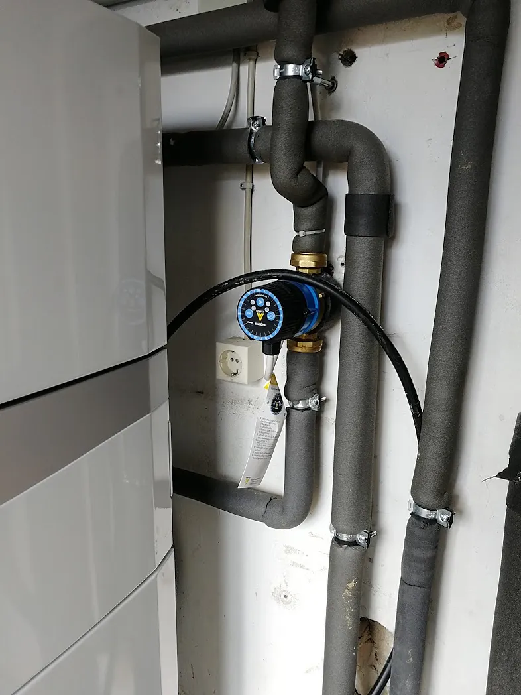
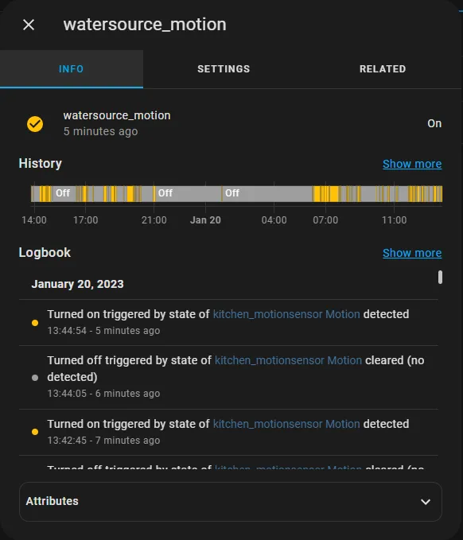

The gas price went nuts in 2022. Thanks to Home Assistant I was able to save quite some money without losing any convenience. Here is how.

## Step 1: Gathering data
My house is heated by a gas heater. This is pretty common in Germany. I can read my gas consumption on the dumb gas meter I was provided.



So the first thing I had to do was integrate that gas consumption into Home Assistant.

> It is important to know the status quo so I can evaluate how much I actually saved in the future.

Making dumb gas meters smart is a pretty common problem and there are lots of good tutorials flying around in the internet. I’ll describe my approach. Look at the gas meter again.

The last wheel on the right side has a little magnet attached, right on the number `0`. When this wheel does a full rotation I consumed `0.01m³` of gas. The gas meter also tells me that on the front. It says: `1 imp` (impulse) equals `0.01m³`.

So the solution for tracking the consumption is simply **counting the impulses** of the magnet on that wheel! Example: If I count `120` impulses I consumed `1.2m³` gas. Easy math.

You can count magnet impulses with a [reed sensor](https://amzn.to/3iPgcqg). I bought a [Wemos D1 mini](https://amzn.to/3iVfoAo) and soldered both together. Disclaimer: I suck at soldering. If I can do it, you can do it too. If you do it, please you the correct wire colors. I didn’t know them by then…



I attached the reed sensor right under the last wheel of the gas meter with some good old [duct tape](https://amzn.to/4gCgs51). There are definitely better options like creating some fancy holder with a [3D-printer](https://amzn.to/3ZCbRK6). But I neither have the money nor time to get and use one. But duct tape works just fine.



I hide the Wemos and all cables in a [junction-box](https://amzn.to/3HfDwqB) which I fix to the gas meter with [zipties](https://amzn.to/3iTWCcy).



Now I need to add some life to my Wemos. I use [ESPHome](https://esphome.io/) for that. Since impulse counting is a pretty common task, there is an existing platform for that. So no re-inventing the wheel here. This is how my yaml file looks:

```yaml
esphome:
  name: serverroom-gasmeter

esp8266:
  board: d1_mini

# Enable logging
logger:

# Enable Home Assistant API
api:

ota:
  password: "mypassword"

wifi:
  ssid: !secret wifi_ssid
  password: !secret wifi_password

  # Enable fallback hotspot (captive portal) in case wifi connection fails
  ap:
    ssid: "Serverroom-Gasmeter"
    password: "mypassword"

captive_portal:

sensor:
  - platform: pulse_counter
    pin: D1
    name: "serverroom_gasmeter_currentconsumption"
    unit_of_measurement: 'm³/min'
    accuracy_decimals: 2
    count_mode:
      rising_edge: DISABLE
      falling_edge: INCREMENT
    internal_filter: 100ms
    filters:
      - multiply: 0.01
    total:
      device_class: 'gas'
      name: "serverroom_gasmeter_totalconsumption"
      icon: 'mdi:fire'
      unit_of_measurement: "m³"
      accuracy_decimals: 2
      filters:
        - multiply: 0.01
```

You’ll notice the factor `0.01` I mentioned earlier. That’s just the impulse factor as shown on my gas meter. I also had to tweak the count mode a little. I only want to count the *falling edges*, i.e. only when the magnet is moving away from the reed sensor. Counting *rising edges* as well would mean two impulses on each rotation. I also set an internal filter of `100ms` to avoid unwanted false-positive impulses. You can say that `1m³` has around `10kWh`. It’s not that simple, but you can work with it.

And that’s it! I can now track my gas consumption directly from within Home Assistant.



## Step 2: Understanding the problem
The heater has two separated water circuits:

* The first circuit is the *heat-water-circuit* which leads hot water through the radiators in my house.
* The second circuit is the *use-water-circuit* which leads hot water to the sinks, showers and bath tubs in the house.

This second circuit is the one we will concentrate on. It has a **circulation pump** attached. This pump pumps the warm water through the circuit.

Why? Just for *convenience*.



Imaging the water not being pumped but standing still inside the pipes. There will be a constant heat-loss until the water in your pipe is cold. If you then open the tap in your shower you’ll have to wait quite some time until new hot water moves up from the boiler in the shower tap. I can already see you standing on your toes, freezing, trying not to touch the water…

So that’s why the pump is attached. It provides the circuit with fresh hot water all the time, even when you are not using it. When you open the tap — instant hot water.

Most of these pumps work with a timer switch. They are disabled at night. Because nobody needs hot water instantly at night. And they are enabled all day. Because everybody needs hot water all day.

> But this is simply not true!

Sometimes we need hot water at night — for instance, if I come home late from a concert and want to shower before going to bed. Sometimes I do **not** need hot water at daytime. Maybe we are on vacation for some days.

> So the active time of the pump should not be coupled to the time of the day but to whether someone could currently open a tap!

## Step 3: Knowing when someone could need hot water
This one is easy. There are three rooms in my house that need hot water. The upper bathroom, the guest bathroom and the kitchen. So if anyone is inside one of these rooms, I assume they might need hot water eventually.

So I bought a [motion sensor](https://amzn.to/47KQE2D) for each of these rooms, integrated them in Home Assistant, and created a group helper that combines all of them.

 

## Step 4: Making the dumb pump smart
The pump gets powered by my heater. It is hard-wired. So I attached a [smart relay from Shelly](https://amzn.to/3BdDtuW) to the pump. Now I am able to switch the pump on and off from Home Assistant as I please. And so I do. Here is my automation:


As soon as a motion is detected at one of the water sources, I turn on the pump. I let the pump work for three minutes. That should be sufficient to refresh all the pipes with fresh hot water.

After that I power the pump off again. Now that I have hot water in the pipes, I do not need to turn the pump on again for the next 30 minutes. So I added a delay at the end of the automation.

## Step 5: Calculating the Savings
I have this setup running for around two years. So I have plenty of data to compare. On average this automation saves me `2` to `3` kWh per day. That is not much but it adds up — especially when the gas prices go nuts. In 2022 they were between `16` and `30 cents/kWh` here in Europa. So let’s do some math:

* Minimum: `2kWh * 365 days * 0.16€/kWh = 116.80€/year`
* Maximum: `3kWh * 365 days * 0.30€/kWh = 328.50€/year`

## Conclusion
The actual savings will probably lie somewhere in the middle, maybe around `250€/year`.

They depend on many other factors like outside temperature and how often we are home.

Nevertheless that is a lot of money saved, considering the hardware costs are low and there is absolutely no convenience constraint.

> Everything works just as before, and nobody notices the automation, except my wallet.

Thanks for reading!