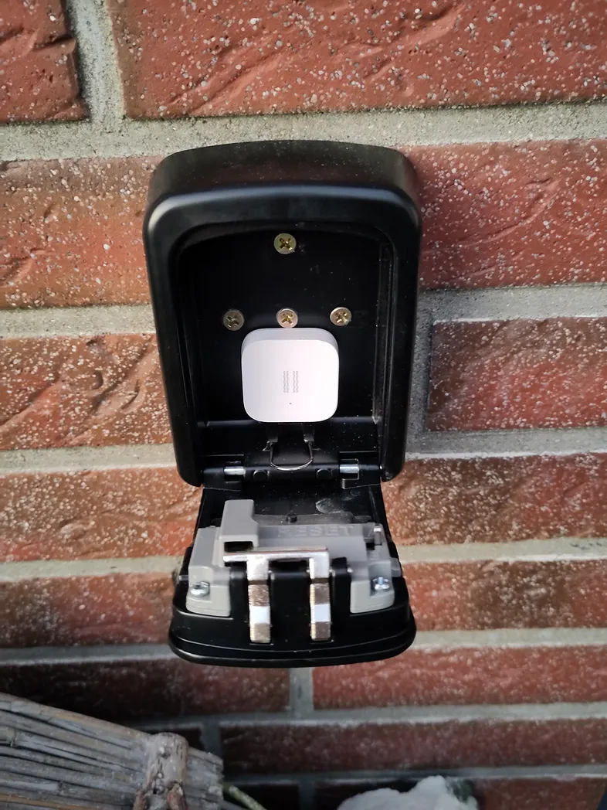

I bet you have a spare key for your home hidden somewhere on your property!

* Is it in the garden? Maybe disguised as a rock?
* Is it right under the doormat?
* Do your neighbors have it?

No matter where it is, it is important to have one! It sucks to come home after a long day, only to realize that you've forgotten your keys. I know that from experience because until recently we didn’t have a spare key.

Why? Because we didn’t know where to hide it. What if the hiding place isn't good enough? What if our neighbors were on vacation right when we need the key?

Thanks to Home Assistant I was able to implement an **overkill-bullet-proof**™ solution for that problem.

> I introduce to you: The Fort Knox Key Safe.

## Security Level 1: The Safe
My solution is based on a [key safe](https://amzn.to/4gR6NYG). It’s pretty convenient for us since it works with a numerical code. Still this safe should scare of casual thiefs that just happened to find the key by accident.

## Security Level 2: The Location
Of course I did not mount the safe right next to the main door. That would be an invitation. It’s somewhere in the backyard, not directly visible since it is hidden by some flowerpots.

## Security Level 3: The Camera
One of my [cameras](https://amzn.to/3Nb7FcS) monitors the location of the safe. That is deterrence. But also I will have visual proof of anyone trying to mess with the safe.

## Security Level 4: The Vibration Sensor
Inside the key safe I attached a [vibration sensor](https://amzn.to/47MCDl3). That way I will be alerted if someone opens the safe or even tries to remove it from the wall. Spinning one of the number wheels is already enough for the sensor to detect a vibration.

## The Bulls**t Heist
Someone sneaks in my backyard. It takes him 30 minutes to find the key safe. He tries to guess the combination. No success after 15 minutes. He takes out the jimmy and tries to rip the safe from the wall. The police arrive.

What happend? I received a notification on my phone because the camera detected a person in the backyard. I also received a notification that someone tried to open the safe due to the vibration sensor. Plenty of time to check the camera stream and call the cops.

## Honest Summary
This solution is total overkill. I guess hiding a key somewhere in flowerpot is safe enough. But this solution is so much fun. And it gives me a false sense of safety. If you are a burgular: Please don’t take that as a challenge. 

To be honest: A thief would probably just break a window with a rock instead of looking for a hidden key. But that’s no reason for skipping the fun of Home Automation. Your home just needs to be more secure than your neighbor’s.