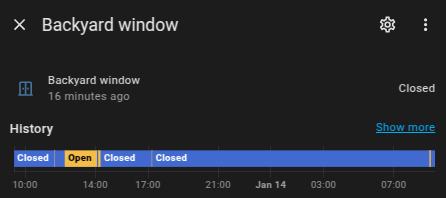
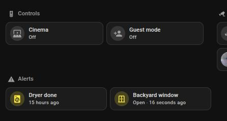
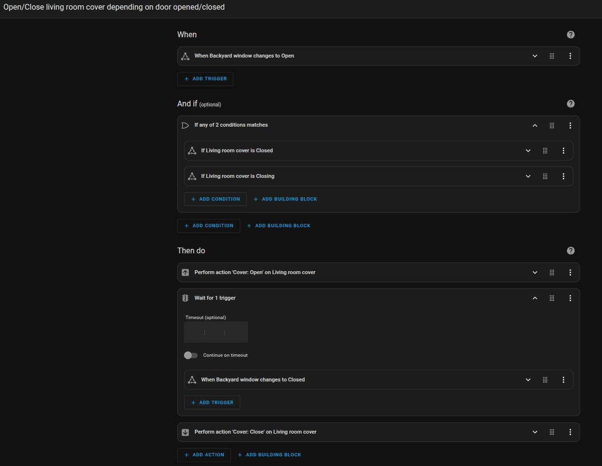

I've installed quite some smart home stuff in my house. Some projects I'm really proud of, like the [music box I built for my daughter](https://www.cellos.blog/spotify-made-my-daughter-cry-home-assistant-made-her-smile-again/). Others are super nerdy, like the [smart meter I made for my gas meter](https://www.cellos.blog/how-home-assistant-saves-me-250-every-year/).

I would have expected visitors who are not so tech-savvy to be really impressed by that.

To my surprise, however, I always find that another, totally dumb automation is the winner of the visitors' hearts... But first a little more background:

## Open house
We enter our garden directly from the living room via a patio door. The door has a [handle](https://amzn.to/4jgGhcb) like the ones on windows. If you turn the handle horizontally, the door can be opened. If the handle is pointing downwards, it is locked.

This door was often accidentally left open because it was only pushed shut but the handle was left in the horizontal position. This makes you feel quite uncomfortable when nobody is in the house.

A smart solution had to be found...

## Home Assistant to the rescue!
The classic solution for detecting open windows and doors is using [smart magnetic contacts](https://amzn.to/3DQutx0), which I've installed a lot in my house. But for this problem door, of course, that's not enough because it's `closed` according to the magnetic contact but not really `locked` due to the handle position.

But after a bit of research, I found out that there are also [door handle sensors](https://amzn.to/3E3Tl4s)! They don't seem to be quite so common because there isn't such a wide vendor range, but they are just right for this application.

They tell me which position the door handle is in, regardless of whether the door is open or closed.

This is exactly the state I need to solve the problem. For example, I can now show on our dashboard that the door is open. This means we can see this directly before we leave the house or go to bed. I also send a message to my cell phone if the door is still open while no one is at home.

But now to our guests' favorite automation:

## The guest's favorite
The door also has a blind. If the blind is down but I need to go out into the garden (to get a beer, cough), now all I have to do is turn the door handle and the blind goes up automatically. No need to press a button on the blind switch. As soon as I'm back in the house and turn the door handle to the closed position, the blinds go down again.

The whole thing really isn't rocket science. I can recognize the door handle as described above via the door handle sensor and I can control the blinds via the [built-in smart relay](https://amzn.to/407MsXa). Linking the two in home assistant is trivial.

Nevertheless, every guest wants to try it out for themselves and has a grin on their face. I guess it seems like magic when a door handle controls the blinds...
