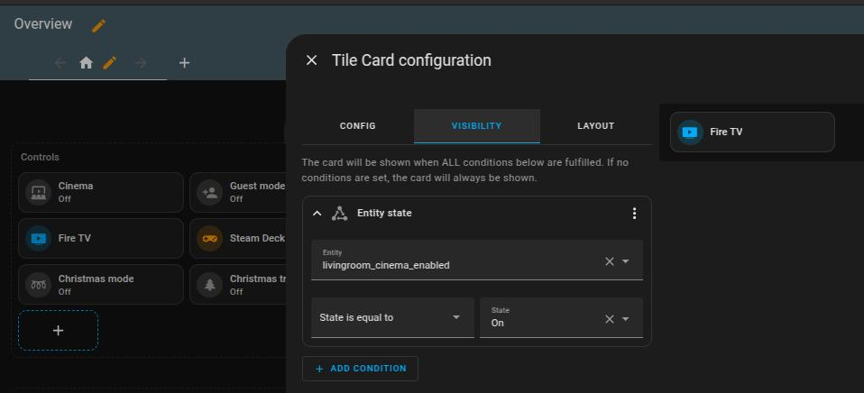

## The Problem
I recently became the proud owner of a [Steam Deck](https://www.steamdeck.com/de). Most of the time I play comfortably on the couch in handheld mode, but every now and then I want to throw a game onto the screen via my [projector](https://amzn.to/3BYzdQQ). To do this, I ordered a [dock](https://amzn.to/3DIsDhH) that connects the Steam Deck to my projector via HDMI.

I now have two input sources for my projector. One is the [Fire TV cube](https://amzn.to/40jx9w3) for watching series and the other is the Steam Deck for gaming. I have connected both with a cheap [HDMI switcher](https://amzn.to/4a2SYmR), so that I don't have to change the HDMI cable every time. It automatically recognizes which input has an HDMI signal and activates that route to display on the screen.

However, this only works half well. For example, if I send the Steam Deck to standby, the picture from the Fire TV cube doesn't come up. Or if I played games the day before and start the cinema today, the picture occasionally stays black because the Steam Deck is still blocking the HDMI input. Then I either have to remove the Steam Deck from the docking station (and get up from the couch, yikes!) or switch the source of the HDMI switcher via IR remote control. Neither option is a solution, of course.

## Home Assistant to the Rescue

The only device that needs to be made smart here is the HDMI switcher. It is already half smart, as it can be operated via IR remote control. The only thing we need to teach Home Assistant the IR protocol is an inexpensive little helper: an [IR blaster](https://amzn.to/4a2T6Tn). In other words, a device that is able to learn IR commands and send them back itself. A smart universal remote control, so to speak. I still had a [Broadlink RM4](https://amzn.to/4a2T6Tn) in my cable box for this purpose.

I connected it and placed it right next to the HDMI switcher. Learning the commands, i.e. the buttons that switch to input 1 or 2, is now super easy in Home Assistant. It's just an action that needs to be executed via the Developer tools:

I give the commands a name, i.e. `goto-hdmi-one` or `go-to-hdmi-two`, and say which remote control this command belongs to, in this case `hdmi-switcher`. I then click on perform and press the button on the remote control in the direction of the IR blaster. Done.

Now this command can be re-fired via actions, i.e. the Developer Tools. If necessary, this can be done x times in succession if the connection is not robust enough:

Top. So now I am able to select the input via Home Assistant. So, how does this solve my original problem?

## Fixing the Issue
First of all, I want to have the Fire TV as the default HDMI input for my projector. So when I start my home cinema, I now explicitly set this input. This means that it doesn't matter whether I played games the night before or not.

I have also put the HDMI selection on my dashboard so that I can change the mode from the couch.

To do this, I simply added two new tile buttons to the dashboard, which are only visible when the cinema is active. When clicked, the buttons simply execute the corresponding remote command.

 

And that's it. A tiny little problem that was solved super easily with Home Assistant. My suggestion: If you are still using old IR remotes, just make them smart!

