Everybody knows the famous [Toniebox](https://amzn.to/3WRLnjE). It's a wonderful device which lets kids start music or an audio book just by putting a little figure on top of it. Every friend of our daughter got one on their second birthday. So the pressure was high.

> My daughter looked at me with her big eyes — She wants one, as well!

But that cute little cube is not cheap. Especially the costs for the [Tonie figures](https://amzn.to/3Zh2OLT) stack up fast… 15€ per figure times ten audio books: That's 150 bucks — for audio books that are already available with my Spotify subscription.

That's when I heard about and fell in love with the [Phoniebox](https://phoniebox.de/index.html) project. Building a DIY Toniebox for my daughter sounded like a really cool gift for her birthday.

I studied [this excellent blog post](https://splittscheid.de/phoniebox-bauanleitung-toniebox-alternative/) and managed to build a fancy little box without any prior soldering experience:

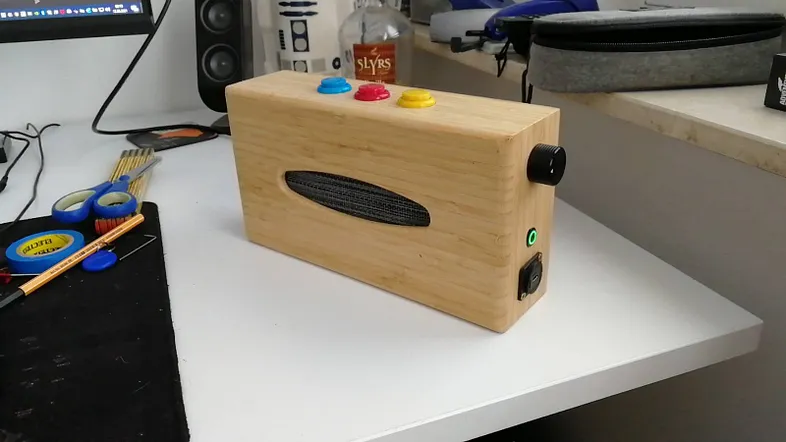

And the best part: I was able to add as many audio books as I want without further costs! All content came directly from Spotify.

> My daughter was happy. I was proud. Success.

## The Catastrophe
Then it happened. My wife called me at work:

> The box is not working. Did you tinker around again?

I did nothing. But Spotify did. [The library libspotify got discontinued](https://developer.spotify.com/community/news/2022/04/12/libspotify-sunset/). A library the Phoniebox project heavily relied on. From one day to the next, thousands of Phonieboxes in the Spotify version stopped working.

My daughter was sad, even cried a little. I guess she was not the only one. I promised myself that this will not happen again!

That's why I built my own music box. A music box powered by Home Assistant. A music box I have full control over.

## Step 1: The tag reader
My box will need to register NFC cards. So I have to include an NFC reader. The Home Assistant tags documentation references a [cool project on Github](https://github.com/adonno/tagreader) for a standalone tag reader.

Exactly what I needed! All material needed are a [wemos D1 mini](https://amzn.to/3GNm78F), a [NFC reader](https://amzn.to/3IpgVJf) and a [buzzer](https://amzn.to/3Qmm0DT). That's it.

I ditched the LED since I don't wanted to integrate one in my box. Following the readme I was able to solder everything together and flash the firmware on the wemos D1 mini.

## Step 2: Buttons
The Home Assistant docs really have a lot of information about the [tags feature](https://www.home-assistant.io/integrations/tag/). Especially the chapter [Building an RFID jukebox](https://www.home-assistant.io/integrations/tag/) is nearly all I wanted.

But I want to have actual [physical buttons](https://amzn.to/3vMdPaJ). My daughter needs some buttons for play, pause, next, previous, volume up/down. So I bought some.

 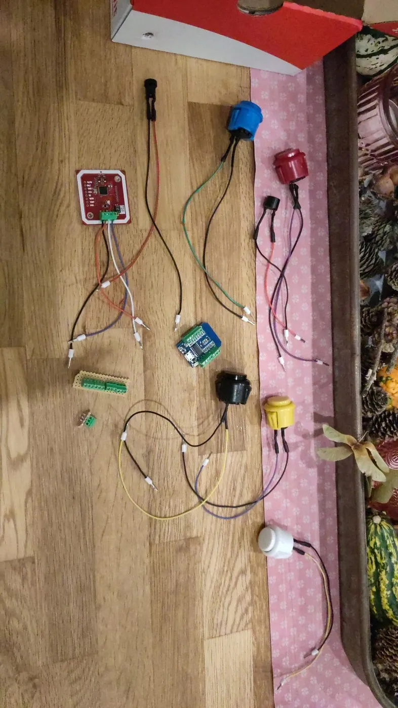

## Step 3: Building the box
I bought a [small bambus box](https://www.ikea.com/de/de/p/dragan-badezimmer-set-4-tlg-bambus-40222607/) from IKEA. I drilled some holes in it with [these guys](https://amzn.to/3VRJu51). Then I attached everything into the box with some hot glue.

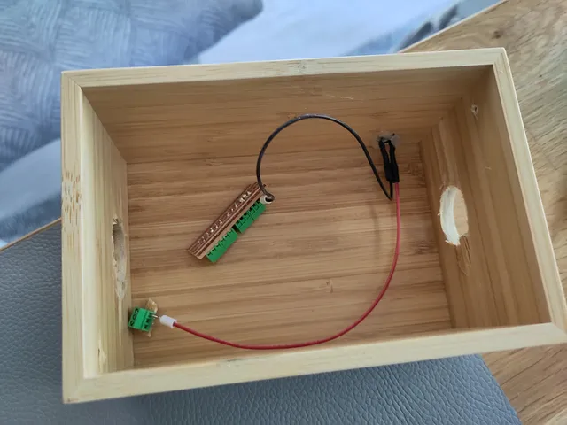 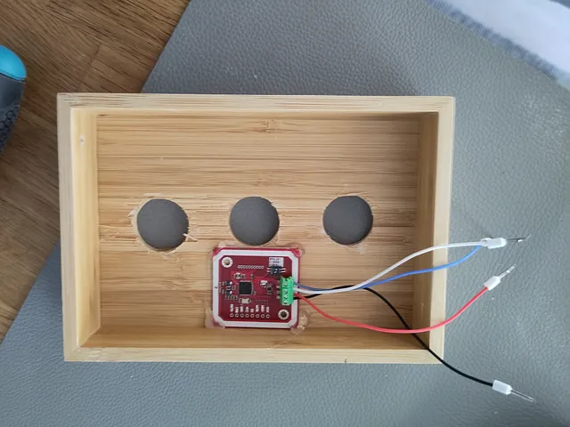 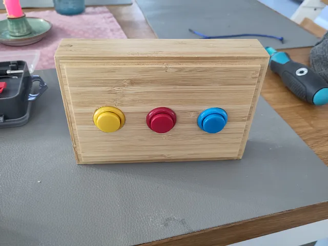 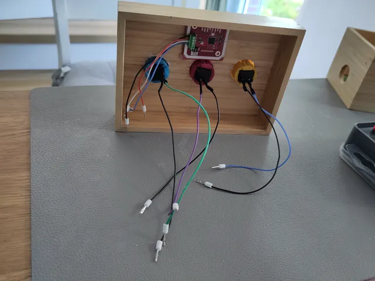

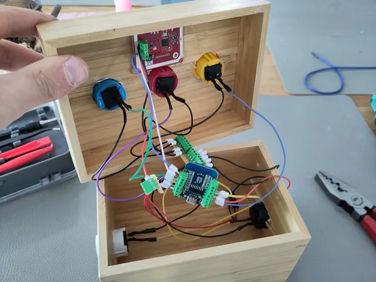 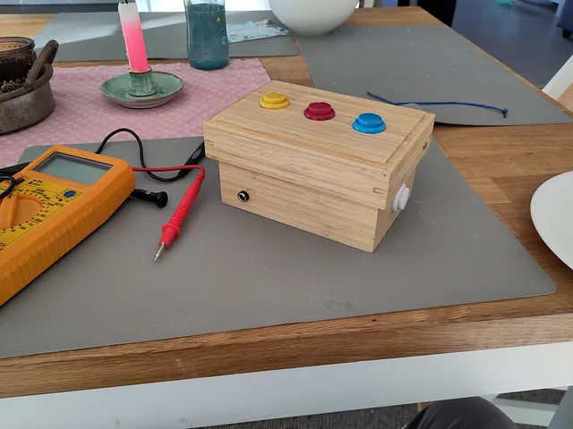 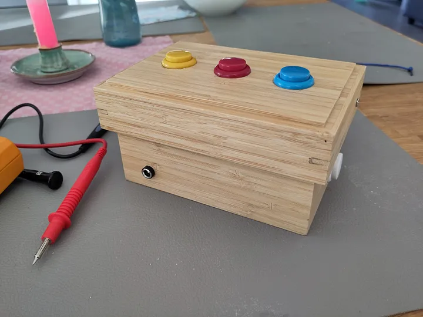 

I really learned a lot this time. This was the first time I soldered [screw mounts](https://amzn.to/3WXSg2N) on the board. The benefit, in contrast to hard-soldering the cables to the board, is that you are able to detach them if needed. This comes in really handy if you need to debug something.

I also used [cable end crimps](https://amzn.to/3GlFXX0) for the first time. No more wire fibers! And they can be easily attached into the screw mounts.

This was the first time I am actually proud of my cable management — although I guess any professional would puke looking at this. If so, please give me some tips! I'm eager to learn. Thanks!

The whole box is powered by a [5V power supply](https://amzn.to/3VQYsYZ). The ESP gets powered directly over its 5V pin. Don't use the usb port for powering. I ran into all kind of issues like the NFC reader not working.

I integrated a [coaxial power connector](https://amzn.to/3GPs9Fw) into the box, and it works like a charm. However, make sure you buy a connector that matches the size of your power supply. If they don't match, you will have a loose connection. There are two or three common sizes — just check the datasheets once and you should be fine.

## Step 4: Tweaking the firmware to support the buttons
To add the different buttons to the firmware and Home Assistant I had to add some binary_sensors to the ESPHome yml file of my music box.

```yaml
binary_sensor:
  - platform: gpio
    name: "liasbox_playplause"
    
    pin:
      number: D4
      inverted: true
      mode:
        input: true
        pullup: true
    filters:
      - delayed_off: 10ms
      
  - platform: gpio
    name: "liasbox_next"
    pin:
      number: TX
      inverted: true
      mode:
        input: true
        pullup: true
    filters:
      - delayed_off: 10ms
      
  - platform: gpio
    name: "liasbox_previous"
    pin:
      number: D3
      inverted: true
      mode:
        input: true
        pullup: true
    filters:
      - delayed_off: 10ms
  
  - platform: gpio
    name: "liasbox_volume_down"
    pin:
      number: D5
      inverted: true
      mode:
        input: true
        pullup: true
    filters:
      - delayed_off: 10ms 

  - platform: gpio
    name: "liasbox_volume_up"
    pin:
      number: D6
      inverted: true
      mode:
        input: true
        pullup: true
    filters:
      - delayed_off: 10ms 
      
wifi:
  ssid: !secret wifi_ssid
  password: !secret wifi_password

substitutions:
  name: "liasbox"
packages:
  adonno.tag_reader: github://adonno/tagreader/tagreader.yaml
esphome:
  name: ${name}
  name_add_mac_suffix: false
```

Now I have all buttons available as entities in Home Assistant, yay!

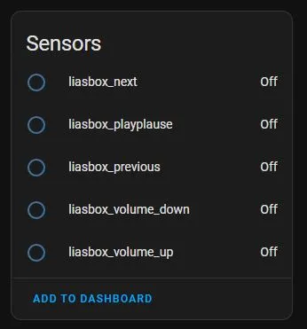

## Step 5: Let the buttons execute automations
Play/Pause, next, previous and volume up/down are all standard services of media_player entities. So all I had to do was trigger all those services when a button gets pressed. Here is an example for skipping to the next song:
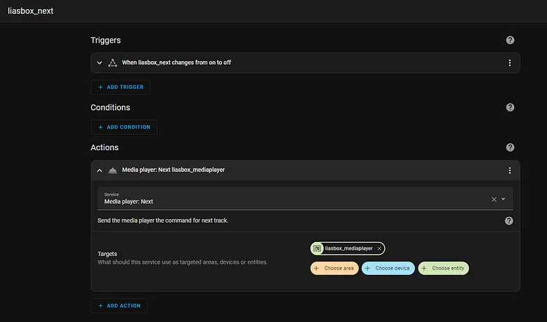

I made similar automations for the other buttons, as well.

As you can see I capsuled the media player I want to use for my box as a helper entity. I did this because currently the music will start on our [Sonos bar](https://amzn.to/3ZmPZzH) in the living room. That's where the box is located. But in a few years the box will move to my daughter's room. She will get her own little Sonos box (maybe the next good birthday present!?). And then I will be able to switch the media player very fast without needing to adjust all automations.

The helper is a group with a single entity.

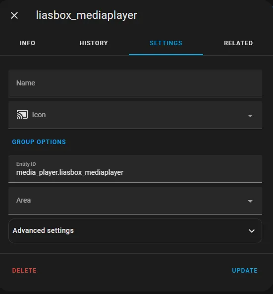

## Step 6: Creating the cards
The cards are simple [NFC cards](https://amzn.to/3vOT3Hu), but of course, they have to look good; I can't just write the title on the card with an Edding. My daughter can't read.

So my way is to print the audio books cover on a sticker. [I use these](https://amzn.to/3Gq7mXO) because they come with an online software where I can upload the covers and resize them easily.

The result looks okay. It would definitely look cooler with a [card printer](https://amzn.to/3ikt5IT). But that's just too expensive for me.

## Step 7: Adding and triggering tags
After the NFC reader was added to Home Assistant (which is really easy if you followed the documentation from Github, since it is discovered automatically), you are able to add new tags. This can be done in the tags menu. When swiping an NFC card over the box, a new tag appears. It has a GUID as name. I immediately rename the tag to the content it should contain.


The automation that is triggered by the tag scan and actually starts the music is just a tweaked version of the example from the [tag documentation](https://www.home-assistant.io/integrations/tag/#building-an-rfid-jukebox). This is how it looks:

```yaml
alias: Handle Tag Scan
description: ""
trigger:
  - platform: event
    event_type: tag_scanned
condition:
  - "{{ trigger.event.data.tag_id in tags }}"
action:
  - variables:
      media_player_entity_id: media_player.liasbox_mediaplayer
      media_content_id: "{{ tags[trigger.event.data.tag_id].media_content_id }}"
      media_content_type: "{{ tags[trigger.event.data.tag_id].media_content_type }}"
  - service: media_player.play_media
    target:
      entity_id: media_player.liasbox_mediaplayer
    data:
      media_content_id: "{{ media_content_id }}"
      media_content_type: "{{ media_content_type }}"
  - service: script.liasbox_setmediaplayersettings
    data: {}
  - delay: 2
mode: single
max_exceeded: silent
variables:
  tags:
    04-6E-DA-67-10-02-89:
      media_content_id: >-
        https://open.spotify.com/playlist/1u0bu4ezkj4QHDkfjXwKsW?si=76e77a3055134782
      media_content_type: playlist
    04-1C-E4-67-10-02-89:
      media_content_id: >-
        https://open.spotify.com/album/33Ss311uVWQViCaipw2laT?si=EfWjPNX4SieRiID3GbpnDA
      media_content_type: album
    04-A3-7A-67-10-02-89:
      media_content_id: >-
        https://open.spotify.com/album/0FHpjWlnUmplF5ciL84Wpa?si=9DLx-nzTS7uVkoH9YsEvvA
      media_content_type: album
    04-75-8C-67-10-02-89:
      media_content_id: >-
        https://open.spotify.com/album/3qAjGnHFbafzKWbntBjKb9?si=AeKRaR1eQ7S2RjLf41_aMA
      media_content_type: album
    04-4A-90-67-10-02-89:
      media_content_id: >-
        https://open.spotify.com/album/6LQALkZO2BD7UJW5Rbe7AQ?si=-BrXCB_2T0ihqJKTxigefg
      media_content_type: album
    04-31-8F-67-10-02-89:
      media_content_id: >-
        https://open.spotify.com/playlist/5AkNkdpGiTUT1Z1usDdiey?si=8723fd4d8fc5464f
      media_content_type: playlist
    04-83-98-67-10-02-89:
      media_content_id: >-
        https://open.spotify.com/album/5ju4E5z2e8haWhNVI6jvah?si=sbeJ0sWhTBq2fcYT3WKCSg
      media_content_type: album
    04-2B-82-67-10-02-89:
      media_content_id: >-
        https://open.spotify.com/playlist/6cKzIXYEkC2TtuTt07lOZe?si=86b2176eec0649e0
      media_content_type: playlist
    04-84-AA-67-10-02-89:
      media_content_id: >-
        https://open.spotify.com/album/3XOuj8bXBsPPJ5hmdtcGCd?si=sjuLO1LjTqut3501iOp_AA
      media_content_type: album
    04-04-7A-67-10-02-89:
      media_content_id: >-
        https://open.spotify.com/album/3MJtb4tIcyxbd7PIm5ASJ9?si=spXJG6INSbSI8szm6SgN_g
      media_content_type: album
    04-22-B8-63-10-02-89:
      media_content_id: >-
        https://open.spotify.com/album/12TT6OcOHRaM9HfWlfppxN?si=VzwdAKyWT7u9bVpA9L7LeA
      media_content_type: album
    04-EC-BA-63-10-02-89:
      media_content_id: >-
        https://open.spotify.com/album/1BDF8UTWY6wpxLzF6um2xQ?si=xX_ocM5NT5uFapCuuL7JKA
      media_content_type: album
```

As you can see, it's really not that complicated. You just modify the media_player you want to use and add each content as a new row. You get the ID from the tags menu and the link by using Spotifys “Share” button on the album you'd like to use.

## The result


I really like the new box. My daughter loves it and uses it every day. My wife hates it, because she has to listen to the same audio books every day.

I learned so much doing this project. And I know that if something breaks, it's my fault and I will be able to fix it.

My daughter is happy again and so am I! Thanks, Home Assistant.

## Update 2024
I built a further improved version of the box as a birthday present. But maybe this is content for another post…  

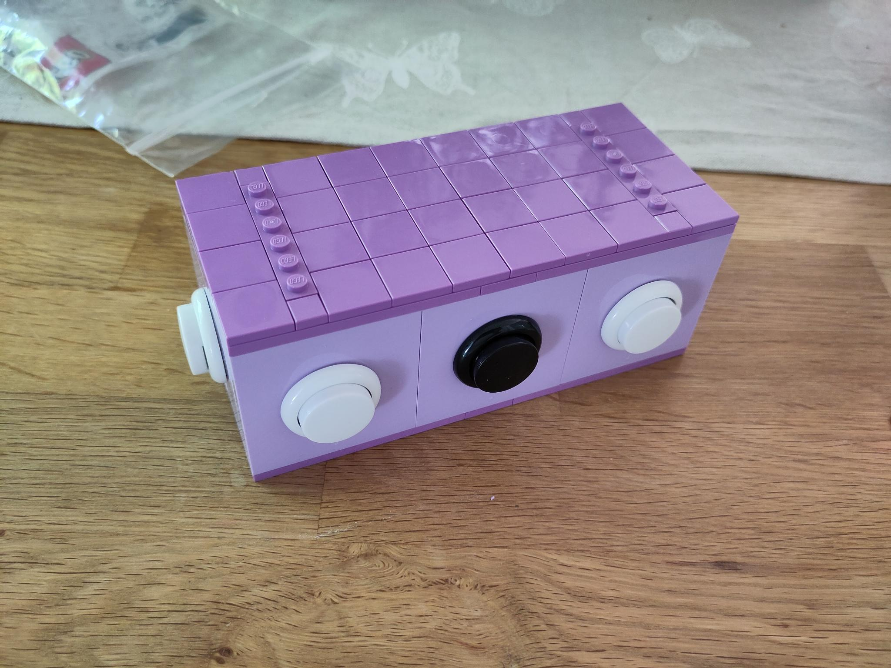 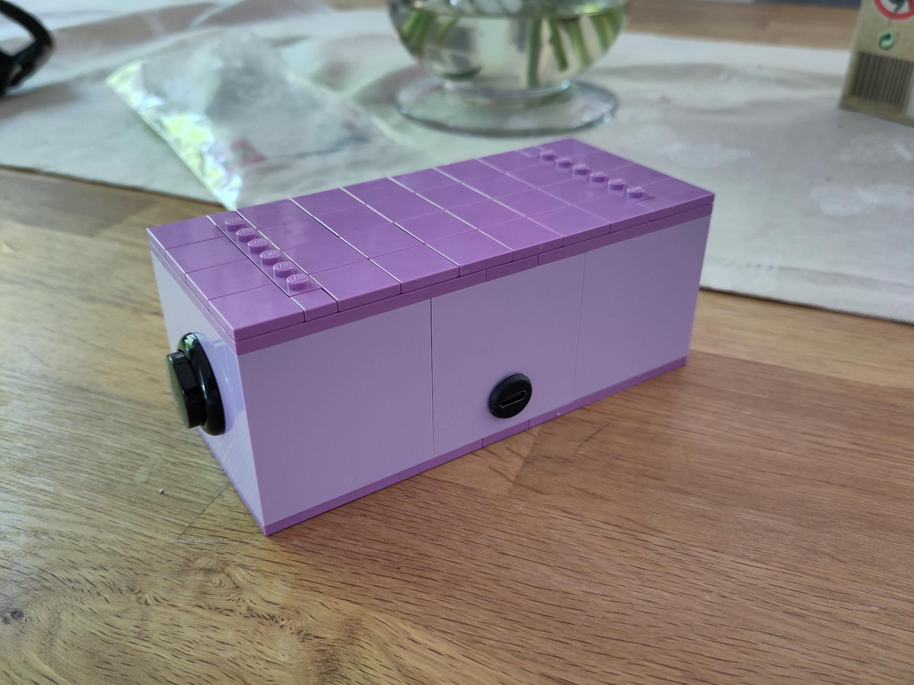